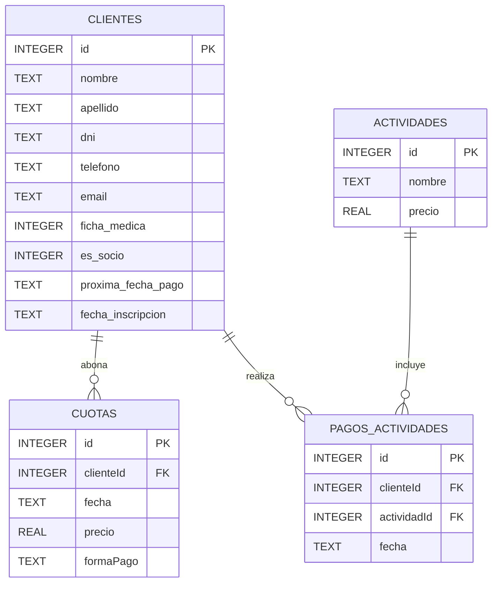

# Club Deportivo Victoria 🏋️‍♂️

## 📝 Descripción
Club Deportivo Victoria es una aplicación desarrollada en **Android Studio** que permite a los empleados del club gestionar de manera eficiente las operaciones diarias, incluyendo:

* 🧍‍♂️ Alta de socios y no socios.
* 💳 Gestión del pago de cuotas.
* 🏊 Inscripción a actividades ofrecidas por el club.
* 📋 Listado de clientes a quienes se les debe cobrar la cuota.

🎯 El objetivo es simplificar la administración y mejorar la experiencia tanto de los empleados como de los socios del club.

## 🎨 Diseño
Puedes ver el diseño y prototipo de la aplicación en Figma 👉 [Enlace al proyecto Figma](https://www.figma.com/design/bIp8TEj7knFlhdlPXGZzRu/App-de-Club-Deportivo?node-id=0-1&t=pQJngDT8txofbL1O-1)

## ⚙️ Tecnologías utilizadas
- Kotlin
- Android Studio
- XML para layouts
- SQLite (Base de datos local)

## 🗄️ Base de Datos

La aplicación utiliza **SQLite** mediante una clase personalizada `DBHelper`.  
La BD se crea automáticamente al ejecutar la app y se inicializa con algunos **clientes mock** para pruebas, incluyendo casos con cuotas que vencen en el día de la fecha.

### Tablas creadas por la aplicación:

- **CLIENTE**  
  Almacena información de socios y no socios:  
  nombre, apellido, DNI, teléfono, email, si es socio, próxima fecha de pago, fecha de inscripción.

- **ACTIVIDAD**  
  Contiene las actividades que ofrece el club.

- **INSCRIPCION**  
  Relaciona clientes con actividades (relación muchos-a-muchos).

---

## 🗺️ Diagrama de Base de Datos (ERD)

## 🚀 Instalación
1. Clonar el repositorio: `git clone https://github.com/Maricroma/ClubDeportivoVictoria.git`
2. Abrir el proyecto en Android Studio.
3. Ejecutar la app en un emulador o dispositivo Android.

## 📱 Uso

* 🔐 Iniciar sesión como empleado del club
* ➕ Dar de alta socios o no socios
* 💰 Gestionar pagos y cuotas
* 🏸 Inscribir clientes a actividades
* 📊 Visualizar listado de clientes con cuotas que vencen en la fecha

## 🧪 Nota sobre pruebas

La base de datos ya está implementada.
La app incluye:
* Creación de un usuario administrador para gestionar la app.
  
Debe ingresarse al realizar el login:
Usuario: "admin"
Contraseña: "123456"

* Carga automática de datos de prueba (mock) de clientes que les vence cuota en la fecha, al crear la BD.

## 🤝 Contribución

Si deseas contribuir:

1. Haz un fork del proyecto.
2. Crea una rama con tu funcionalidad: `git checkout -b feature/nueva-funcionalidad`.
3. Haz commit de tus cambios: `git commit -m "Agrega nueva funcionalidad"`.
4. Haz push a la rama: `git push origin feature/nueva-funcionalidad`.
5. Abre un Pull Request para revisión.

